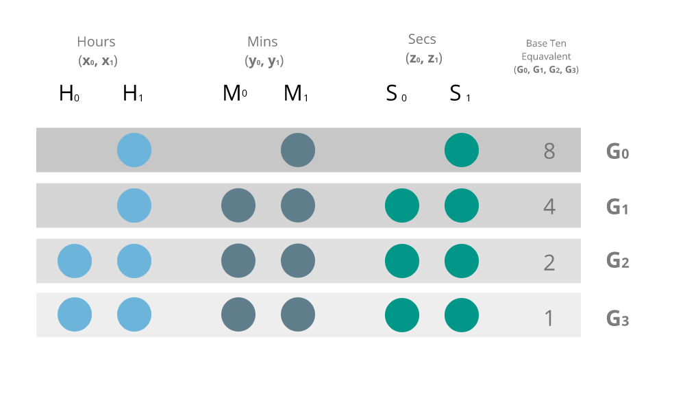
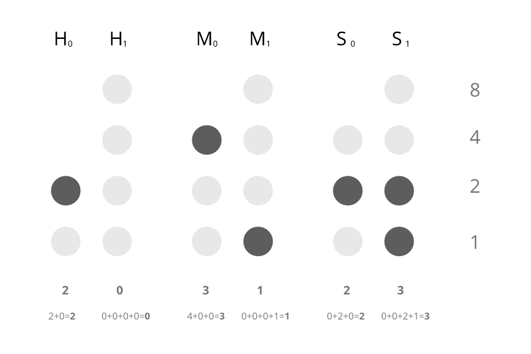

# BinclockJS

A lightweight Javascript module for displaying time (12hrs & 24hrs) in binary format

---

# How it works

This is just an overview of how everything works. If you are interested in the actual implementation then have a look at the `./dist/main.js` file (don't worry its quite commented). Or if you want to see a binary clock in action just open the `./example/index.html` file in a browser.

A normal clock displays time in the following format :-

### hh:mm:ss

where depending on whether its displaying in 24hr or 12hr the maximum value for the first `h` value is `2` or `1` respectively.

Therefore, we can further break down this format as such:-


That is, we can divide each value of an `H`our, `M`inute and `S`econd into left and right values (`0`, `1`). <br>
Meaning if the time were to be `20:56:21` (24 hr), we could divide the values as follows:-

|    Time    |  full value  |  left value   |  right value  |
|------------|--------------|---------------|---------------|
|   Hours    |     20       |       2       |       0       |
|   Minutes  |     56       |       5       |       6       |
|   Seconds  |     21       |       1       |       1       |


So if we were to translate it into its binary representation we would simply get the binary representation of each left and right value;

|    Time    |  full value  |  left value   |  right value  |  binary left  |  binary right  |
|------------|--------------|---------------|---------------|---------------|----------------|
|   Hours    |     20       |       2       |       0       |       01      |        0       |
|   Minutes  |     56       |       5       |       6       |      101      |      110       |
|   Seconds  |     21       |       1       |       1       |        1      |        1       |

That is basically how the entire clock translates the current time into binary.
There is still something to be considered; the maximum values that can be represented in each left and right value. You may be wondering why we need to worry about such details. Simply put the binary clock is easier to read when we represent the time in a way that can be deduced using a uniform method to tell the time.

This can be inferred from the diagram below;



[**1**] *Lets call these balls **'bulbs'** for simplicity*

A binary clock represents the time by signaling whether a certain bulb in the row (**G**<sub>x</sub>) is '**1**' (on) or '**0**' (off).<br>
Lets look at the hours column first. The highest possible value on the left in the `24 hr clock` is `2` and the highest value on the right is `9`. We just display the bulbs depending on how many are required to represent a given value.

In the case of our hour value we just add all the bulbs that are `1` (**on**) in the column.

If we were to display the time `20:31:23` in the binary clock we do it as follows



> **Note**: If we want to display the time in `12 hr` we just use the top most left value of the hour to represent whether its `AM` or `PM`.<br> I.e if its `AM` the bulb would be off; the highest value on the left of the hour is `1` therefore, when the value is higher than that it indicates that its in the `PM`.

---

## Usage

In the browser just import the 'binclock.js' script. The 'binclockjs' object is binded to the 'window' object of the browser.

In the 'index.html' file
```html
<!-- other tags -->
<script src="/path/to/binclock.js"></script>
<script>
	console.log(window.binclockjs.buildClock)
</script>
```

To use in with NodeJS, simply 'require' the module to use. E.g

```js
const binclockjs = require('binclockjs')

console.log(binclockJS.buildClock())
```

---

Zero-1729 &copy; 2018
