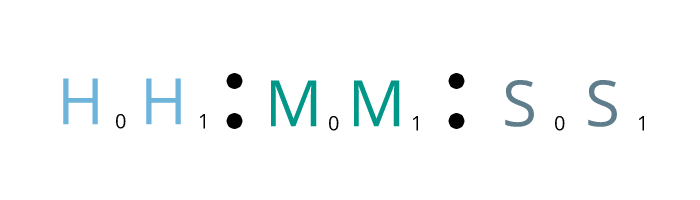

# BinclockJS

A lightweight Javascript module for displaying time (12hrs & 24hrs) in binary format

---

# How it works

> If you are interested in the actual implementation, you should look at the `./dist/main.js` file (don't worry its quite commented). Or if you want to see the binary clock in action, open the `./example/index.html` file in a browser.

A normal clock displays time in the following format:-

### hh:mm:ss

Depending on the format (24hr or 12hr) being displayed, the maximum value for the first `h` value is `2` or `1` respectively.

Therefore, we can further break down this format:-



That is, we can divide each value of an `H`our, `M`inute and `S`econd into left and right values - `0` & `1`. <br>
Meaning, if the time were to be `20:56:21` (24 hr), we could divide the values as follows:-

|    Time    |  full value  |  left value   |  right value  |
|------------|--------------|---------------|---------------|
|   Hours    |     20       |       2       |       0       |
|   Minutes  |     56       |       5       |       6       |
|   Seconds  |     21       |       1       |       1       |


To translate it into its binary representation, we would simply get the binary representation of each left and right value:-

|    Time    |  full value  |  left value   |  right value  |  binary left  |  binary right  |
|------------|--------------|---------------|---------------|---------------|----------------|
|   Hours    |     20       |       2       |       0       |       01      |        0       |
|   Minutes  |     56       |       5       |       6       |      101      |      110       |
|   Seconds  |     21       |       1       |       1       |        1      |        1       |

That is basically how the entire clock translates the current time into binary.

There is still something to be considered: the maximum values that can be represented in each left and right value. You may be wondering why we need to worry about such details. Simply put, the binary clock is easier to read when we represent the time in a way that can be understood using a uniform method to tell the time.

This can be inferred from the diagram below:-


> *Lets call these balls **'bulbs'** for simplicity*

A binary clock represents the time by signaling whether a certain bulb in the row (**G**<sub>x</sub>) is '**1**' (on) or '**0**' (off).<br>
Let's look at the hours column first. The highest possible value on the left in the `24 hr clock` is `2`, and the highest value on the right is `9`. We display these bulbs depending on how many are required to represent a given value.

In the case of our hour value, we add all the bulbs that are `1` (**on**) in the column.

In conclusion, `20:31:23` can be displayed in the binary clock as follows:


> **Note**: To display the time in `12 hr`, we use the top-most left value of the hour to represent whether its `AM` or `PM`.<br> I.e if its `AM` the bulb would be off. The highest value on the left of the hour is `1`, therefore, when the value is higher than that it indicates that it's in the `PM`.

---

## Usage

In the browser, import the 'binclock.js' script; the 'binclockjs' object is bound to the 'window' object of the browser.

In the 'index.html' file:-
```html
<!-- other tags -->
<script src="/path/to/binclock.js"></script>
<script>
    console.log(window.binclockjs.buildClock)
</script>
```

To use with NodeJS, 'require' the module. E.g:-

```js
const binclockjs = require('binclockjs')

console.log(binclockJS.buildClock())
```

---

Zero-1729 &copy; 2018
